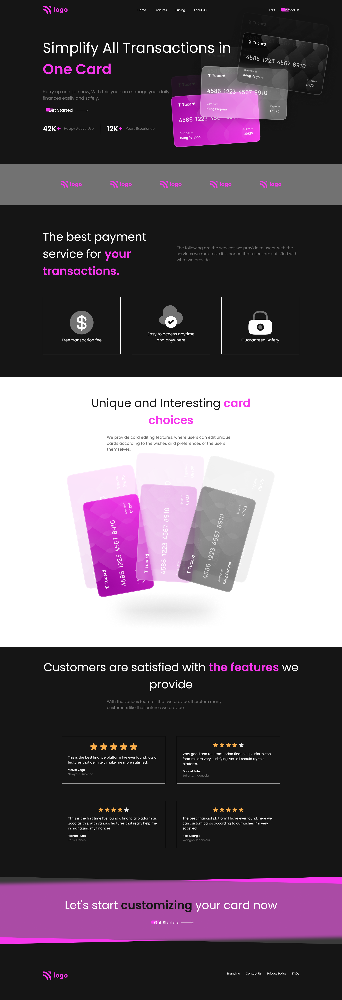

# Frontend Mentor - Huddle landing page with curved sections solution

This is a solution to the [Huddle landing page with curved sections challenge on Frontend Mentor](https://www.frontendmentor.io/challenges/huddle-landing-page-with-curved-sections-5ca5ecd01e82137ec91a50f2). Frontend Mentor challenges help you improve your coding skills by building realistic projects. 

## Table of contents

- [Overview](#overview)
  - [The challenge](#the-challenge)
  - [Screenshot](#screenshot)
      - [Desktop/Laptop](#desktop-view)
      - [Mobile](#mobile-view)
  - [Links](#links)
- [My process](#my-process)
  - [Built with](#built-with)
  - [What I learned](#what-i-learned)
- [Author](#author)
- [Acknowledgments](#acknowledgments)

## Overview

### The challenge

Users should be able to:

- View the optimal layout for the site depending on their device's screen size
- See hover states for all interactive elements on the page

### Screenshot

#### Desktop view

#### Mobile View

### Links

- Solution URL: [Github Repo](https://github.com/Padhysai/credit-card-landing-page)
- Live Site URL: [https://projects.saiprasadpadhy.in/credit-card-landing-page](https://projects.saiprasadpadhy.in/credit-card-landing-page)

## My process

### Built with

- Semantic HTML5 markup
- CSS
- Flexbox
- CSS Grid
- Mobile-first workflow
- CSS Positions

### What I learned

I have learnt about positioning Background Images in the View port and usage of pseudo classes and selectors.

## Author

- Website - [Sai Prasad Padhy](https://projects.saiprasadpadhy.in/)
- Frontend Mentor - [@saiprasad006](https://blog.saiprasadpadhy.in/)
- Twitter - [@saiprasadpadhy](https://www.linkedin.com/in/saiprasadpadhy/)

## Acknowledgments

Thanks Ineuron.ai for the assignment.
